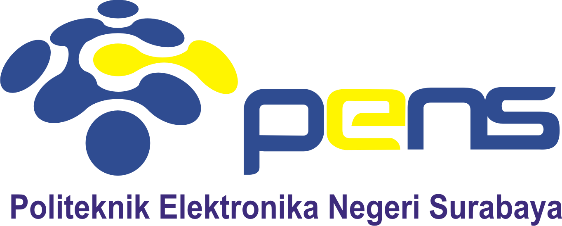

# Rangkuman Webinar "Cloud and IoT Security"

Komputasi awan adalah model yang menawarkan layanan komputasi instan
tanpa menanggung biaya. Namun demikian, seperti teknologi lainnya, ia
membawa kekurangannya. Salah satu masalah utama adalah masalah keamanan
dan privasi termasuk kebocoran data karena infrastruktur sumber daya
komputasi bersama untuk memproses informasi bisnis rahasia - seperti
kekayaan intelektual, rahasia dagang, dan informasi rahasia pelanggan,
yang dapat menyebabkan aktor yang tidak berwenang dapat mengaksesnya.

A.  Threat

1.  Data loss and data leaks

> Sebagian besar fitur perlindungan data cloud untuk perusahaan
> ditawarkan secara terpisah sebagai layanan opsional dan tambahan, mis.
> penyimpanan tambahan untuk retensi snapshot dan anti ransomware karena
> sumber dayanya luas dan mahal.

2.  Abuse and Nefarious Use

> Karena komputasi awan adalah ekosistem multi layanan, interaksi, dan
> saling ketergantungan, telah menjadi lebih umum. Eksploitasi (PagS)
> untuk \"Peretasan sebagai Layanan\" dapat lebih menantang untuk
> dikurangi karena tersembunyi di infrastruktur yang sama.

3.  Insecure Interface and APIs

> Memanfaatkan API yang tidak aman di lingkungan multitenancy dapat
> meningkatkan risiko spionase bisnis, yang berpotensi mengakibatkan
> kompromi atau pencurian data sensitif dan pribadi.

4.  Shared Technology Issues

> Penyedia layanan cloud menggunakan infrastruktur yang dapat diskalakan
> untuk mendukung banyak penyewa yang berbagi infrastruktur yang
> mendasarinya. Pada lapisan terendah, di mana hypervisor dapat
> dieksploitasi dari mesin virtual yang disusupi di sewa lain untuk
> mendapatkan akses ke semua VM di lingkungan bersama yang sama.

B.  The Attacks

1.  Serangan pada platform Cloud yang sama dapat mempengaruhi penyewa
    lainnya. Wajib bagi penyebaran Cloud apa pun untuk mengeraskan
    lapisan virtualisasi untuk mencegah serangan VM ke VM.

2.  Service and Session Hijacking

> Pembajakan Layanan dan Sesi

3.  Man in the Cloud and DDos

> Manusia di Awan dan DDoS

C.  The Security

1.  Cloud Control Layers

> Gunakan lapisan kontrol tambahan dalam manajemen Cloud dari 3%
> penyedia solusi pihak, terutama untuk penyebaran multi-cloud.

2.  Shared Responsibilities

> Gunakan \"perjanjian back-to-back\" dengan Penyedia Cloud Anda untuk
> memastikan kepatuhan standar keamanan penuh.

D.  The Tools

1.  Software Defined Security

> yakinkan kembali solusi Keamanan Cloud tertinggi yang tersedia.

2.  Software defined Security

> Kemajuan AAA untuk setiap Lapisan Cloud misalnya kombinasi biometrik
> wajib.

3.  Inspection and Monitoring

> Penilaian pendapat kedua

E.  The Tests

1.  Cloud Resources Isolation

> Mencegah serangan pivot VM ke VM

2.  Check Lock-in Issues

> Mencegah terjebak dalam produk yang rentan

3.  Check Governance Issues

> Yakinkan kembali standar praktik terbaik

4.  Check Compliance Issues

> Hindari sanksi dan hukuman

5.  Check Data Integrity, Retention, and Disposal

> Mencegah kebocoran dan kerugian

F.  Summary

> Diskusi ini menyampaikan masalah keamanan yang terkait dengan layanan
cloud. Tercatat bahwa penjahat dunia maya telah mengambil keuntungan
dari kerentanan dalam ekosistem bersama dan kurangnya kontrol keamanan
yang efektif, yang menyebabkan penyalahgunaan platform. Peretas dapat
secara ilegal mengakses informasi rahasia penyewa lain yang berada di
infrastruktur cloud yang sama. Oleh karena itu, bisnis disarankan untuk
melakukan penilaian risiko berkelanjutan untuk mengurangi potensi
ancaman terhadap data sensitif mereka.
Selanjutnya, penyedia keamanan cloud harus meningkatkan perlindungan
keamanan melalui penerapan langkah-langkah keamanan proaktif yang lebih
canggih dan canggih untuk mengatasi tantangan ini.
