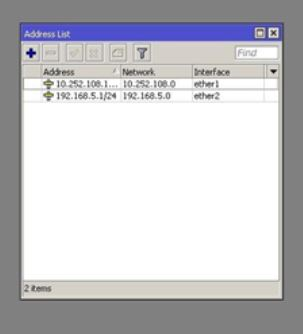
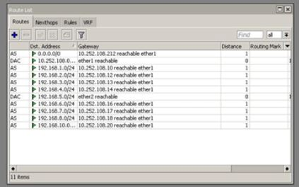
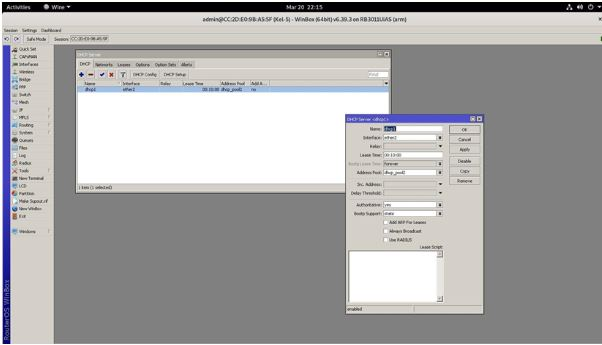
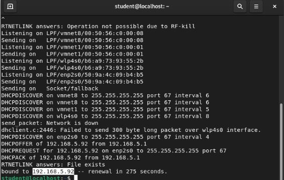
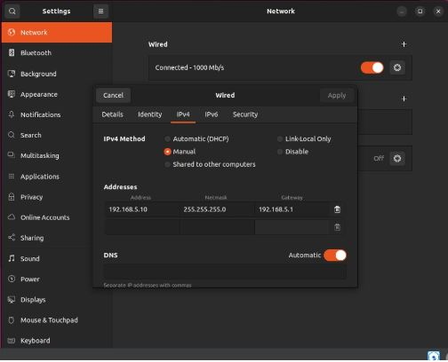

# Laporan Minggu 5


## Kelompok 5
1. Emha Aji Putra Zaman
2. Marits Ikmal Yasin
3. Rizka Dwi Fajriyah

## Tugas
1. Setting IP & Interface
   Untuk menyetting IP address pada pc perlu kita membutuhkan winbox. Untuk membuka winbox gunakan perintah berikut
    ```
    wine winbox64.exe
    ```
    Setelah itu akan muncul tampilan wineboxnya. Setelah itu bisa kita setting secara manual

    
2. Setting IP Route 
   Setelah itu kita perlu untuk melakukan routing secara manual untuk bisa terhubung dengan jaringan lainnya. Dengan cara masuk ke dalam ip -> Route lalu tambahkan route dengan konfigurasi sebagai berikut


   
3. Setting DHCP Server via DHCP Setup
   Pada WinBox masuk ke IP → DHCP Server → DHCP Setup, kemudian pilih konfigurasikan DHCP Server dengan menggunakan ether2 sebagai interface dan konfigurasikan IP pool dari 192.168.5.100 – 192.168.5.254.

   
4. Pastikan PC mendapatkan IP address dari DHCP Server
   - Untuk mengecek IP address pada komputer dapat menggunakan perintah 
   ```
   ip a
   ```
   - Apabila komputer belum mendapatkan IP address dari DHCP Server maka untuk mendapatkan IP tersebut dapat menggunakan perintah 
   ```
   sudo dhclient -v
   ```
   
   
5. Kemudian pastikan VM mendapatkan IP address juga
   Sama seperti pada langkah sebelumnya, untuk mengecek ip address pada VM dapat menggunakan perintah `ip a` dan untuk mendapatkan IP dari DHCP Server dapat menggunakan perintah `dhclient -v`

   
6. Konfigurasi IP VM menjadi static dengan IP (192.168.x.10)
   - Pada pengaturan, pilih tab Network lalu klik ikon pengaturan pada jaringan yang sedang digunakan.
   - Untuk membuat jaringan menjadi static, pilih opsi `Manual` pada IPv4 Method kemudian isikan IP address, Netmask, dan Gateway sesuai dengan konfigurasi yang ada, lalu klik Apply.
   
   
7. Konfigurasi NTP ke 0.id.pool.ntp.org
   - Set up ntp client mengubah pengaturan jam sistem
     - Untuk melihat daftar zona waktu menjalankan perintah : 
     ```
     sudo timedatectl set-timezone Asia/Jakarta
     ```
     - Mengatur RTC ke UTC, menjalankan perintah : 
     ```
     sudo timedatectl set-local-rtc-false
     ```
   - Install NTP server
     - Pertama update terlebih dahulu server dengan menggunakan perintah : 
     ```
     sudo apt update && sudo apt -y upgrade
     ```
     - Menginstall NTP server menggunakan perintah :
     ```
     sudo apt -y install ntp
     ``` 
   - Konfigurasi NTP Server
     - Mengedit `ntp.conf` dengan menggunakan perintah :
     ```
     sudo nano /etc/ntp.conf
     ```
     - Memberikan command pada
     ```
     #pool 0.ubuntu.pool.ntp.org iburst 
     #pool 1.ubuntu.pool.ntp.org iburst 
     #pool 2.ubuntu.pool.ntp.org iburst
     #pool 3.ubuntu.pool.ntp.org iburst
     #pool 4.ubuntu.pool.ntp.org iburst
     #pool 5.ubuntu.pool.ntp.org iburst
     ```
     - Menambahkan Baris
     ```
     server 0.id.pool.ntp.org
     server 1.id.pool.ntp.org
     ```
     - Restart NTP service menggunakan perintah :
     ```
     sudo systemctl restart ntp
     ```
     - setelah itu cek menggunakan perintah
     ```
     timedatectl
     ```
     


8. Konfigurasi Sudo
   - Konfigurasi sudo dapat dilakukan langsung dengan mengubah isi pada file `/etc/sudoers` menggunakan perintah 
   ```
   nano /etc/sudoers
   ```
   - Apabila hanya ingin menambahkan satu user ke dalam grup sudo dapat dilakukan dengan menggunakan perintah 
   ```
   usermod -aG sudo [username]
   ```
9.  Ganti hostname VM menjadi Server10.kelompokX.takehome.com
    - Mengganti hostname pada VM dapat dilakukan dengan mengubah isi file 
    `/etc/hostname ` menggunakan perintah 
    ```
    nano /etc/hostname
    ```
    - Selain itu, dapat juga dilakukan dengan menggunakan perintah 
    ```
    hostnamectl set-hostname [hostname]
    ```
    