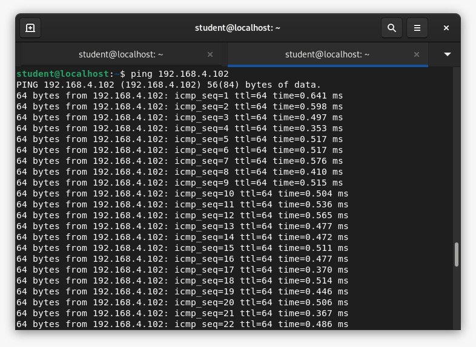
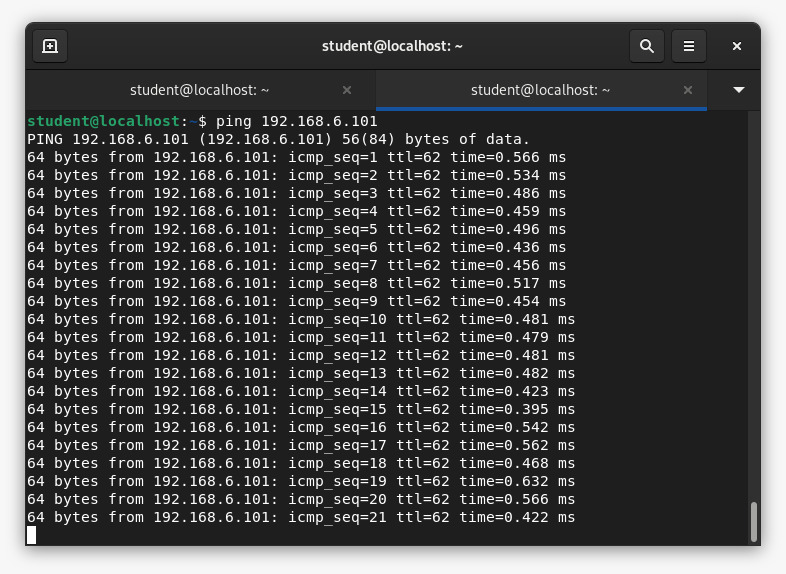
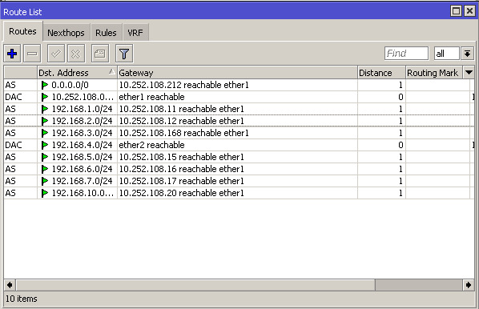

# Routing Mikrotik

### Kelompok 4
1. Troy Fredellius Ardystama (3121600038)
2. Marits Ikmal Yasin (3121600047)
3. Aradhea Rangga Maulana (3121600057)

### IP Addres PC 
IP Address pada PC kelompok 4
1. PC 1 : 192.168.4.101
2. PC 2 : 192.168.4.102

### Mikrotik
Tata cara menginstall winbox
1. Akses web `mikrotik.com/download`
2. Download apk winbox yang berformat .exe sesuai spek pada PC
3. Setelah terinstall maka ketikkan 'wine winbox.exe' pada terminal linux
4. Apabila terdapat eror **it looks like wine32 is missing, you should install it** maka langkah selanjutnya yaitu dengan mendownload paket yang hilang tersebut dengan cara mengetikkan `dpkg --add-architecture i386 && apt-get update && apt-get install win32`
5. Setelah itu, jalankan kembali pada terminal dengan mengetikkan `wine winbox.exe`

### Winbox
Tampilan awal pada winbox

Setelah itu klik **connect**

Selanjutnya kita pilih fitur untuk melakukan routing kepada router yang lain

Pada Dst address masukkan network address dari router lain. Untuk Gateway masukkan gateway dari network tersebut. Setelah itu masukkan seluruh network yang ada.

Kelompok 1
- Network Address : 10.252.108.11
- Gateway : 192.168.1.1

Kelompok 2
- Network Address : 10.252.108.12
- Gateway : 192.168.2.1

Kelompok 3
- Network Address : 10.252.108.168
- Gateway : 192.168.3.1

Kelompok 5
- Network Address : 10.252.108.15
- Gateway : 192.168.5.1

Kelompok 6
- Network Address : 10.252.108.16
- Gateway : 192.168.6.1

Kelompok 7
- Network Address : 10.252.108.17
- Gateway : 192.168.7.1

Kelompok 10
- Network Address : 10.252.108.20
- Gateway : 192.168.10.1

Hasil routing dengan melakukan ping ke setiap jaringan yang ada 

Kelompok 1 :

Kelompok 2 :

Kelompok 3 :

Kelompok 4 :

Kelompok 5 :

Kelompok 6 :

Kelompok 7 :

Kelompok 10 :

Tabel Routing :

## VirtualBox
Tata cara melakukan install virtual box pada debian :
1. Download virtual box pada web `https://www.virtualbox.org/wiki/Downloads` sesuaikan dengan spek pc dan OS yaitu debian 11.
2. Ketikkan `sudo apt install build-essential dkms` pada terminal agar penginstalan virtual box pada debian dapat berjalan
3. Setelah itu masuk ke dalam folder Downloads dengan mengetikkan 'cd Downloads' pada terminal
4. Ketikkan `sudo dpkg -i [versi virtual box (klik tab)]`
5. Penginstalan virtual box selesai

Setelah kita menginstall virtual box maka kita perlu untuk memasang OS Ubuntu pada virtual box. Sebelum itu kita perlu untuk mendownload iso dari Ubuntu pada link berikut : `https://ubuntu.com/download/desktop`

Setelah kita melakukan download, langkah selanjutnya yaitu kita melakukan install OS pada virtual boxnya. Untuk tata caranya cukup mengikuti aturan default saja.