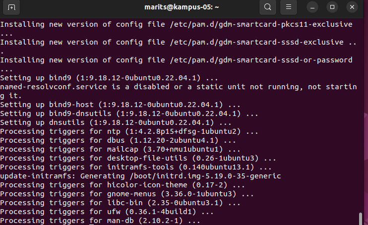
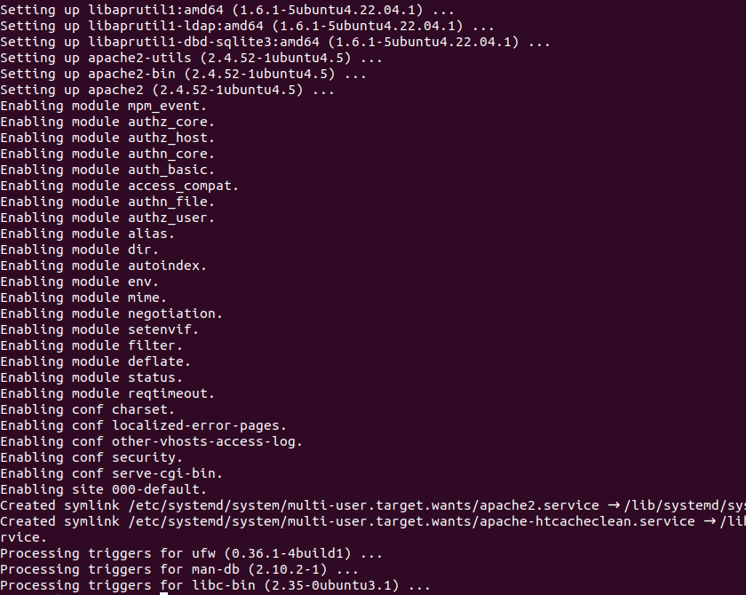
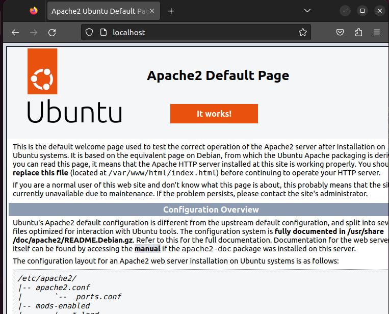
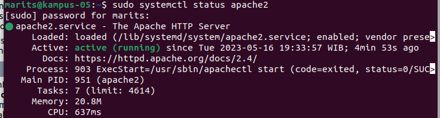
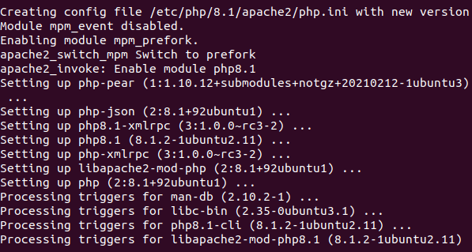
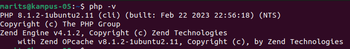
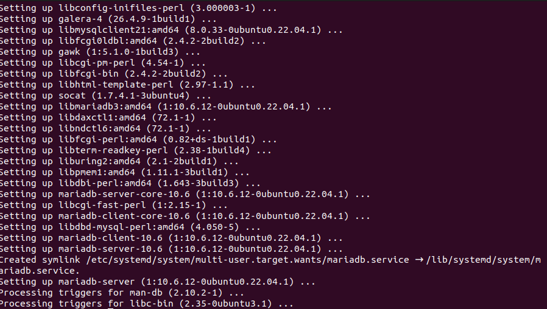

# Laporan Minggu 12


## Instalasi PHP, Apache, dan MariaDB 

## Kelompok 5
1. Emha Aji Putra Zaman (3121600042)
2. Marits Ikmal Yasin (3121600047)
3. Rizka Dwi Fajriyah (3121600050)

#
1. Update sistem dengan perintah :
   ```
   sudo apt-get update -y && sudo apt-get upgrade -y
   ```
   Gambar : <br>
   
2. Install Apache Web Server dengan perintah :
   ```
   sudo apt install apache2
   ```
   Gambar : <br>
   
3. Setelah terinstal maka langkah selanjutnya yaitu menghidupkan servisnya dengan perintah :
   ```
   sudo systemctl enable apache2 && sudo systemctl start apache2
   ```
   Gambar : <br>
   
4. Cek apakah servis apache2 sudah berjalan :
   ```
   sudo systemctl status apache2
   ```
   Gambar : <br>
   
5. Install PHP dengan perintah :
   ```
   sudo apt-get install php8.1 php8.1-cli php8.1-common php8.1-imap php8.1-redis php8.1-snmp php8.1-xml php8.1-zip php8.1-mbstring php8.1-curl
   ```
   Gambar : <br>
   
6. Cek apakah PHP sudah terinstal dengan perintah :
   ```
   php -v
   ```
   Gambar : <br>
   
7. Install MariaDB
   ```
   sudo apt install mariadb-server
   ```
   Gambar : <br>
   
8. Membuat password database dengan perintah :
   ```
   sudo mysql_secure_installation
   ```
   Setelah itu diminta untuk mengisi inputan, untuk inputannya dijawab y, n, y, dan y