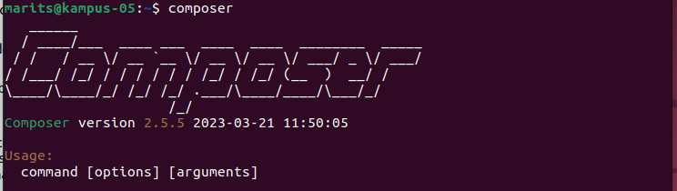
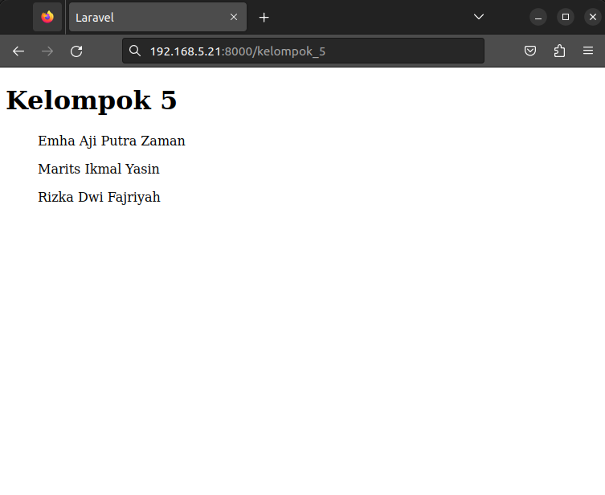
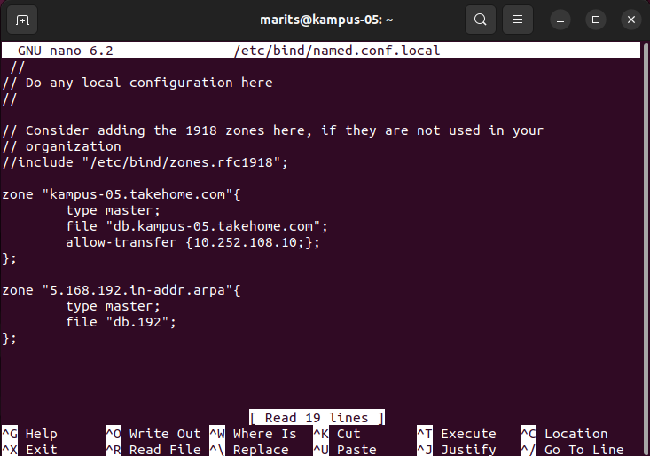

# Laporan Minggu 13


## Instalasi Composer dan Laravel

## Kelompok 5
1. Emha Aji Putra Zaman (3121600042)
2. Marits Ikmal Yasin (3121600047)
3. Rizka Dwi Fajriyah (3121600050)

#
1. Install Composer dengan curl :
   ```
   curl -sS https://getcomposer.org/installer | php
   ```
2. Jalankan perintah ini secara berurutan agar composer dapat dijalankan secara global :
   ```
   sudo mv composer.phar /usr/local/bin/composer
   ```
   ```
   sudo chmod +x /usr/local/bin/composer
   ```
3. Cek apakah composer sudah terinstall dengan perintah :
   ```
   composer
   ```
   Gambar : <br>
   
4. Install Laravel :
   ```
   composer create-project laravel/laravel kelompok_5
   ```
5. Jalankan laravel dengan perintah :
   ```
   php artisan serve --host=IP --port=8000
   ```
   Di sini menggunakan IP : 192.168.5.21
   Gambar : <br>
   
6.  Setting allow-transfer :
   ```
   sudo nano /etc/bind/named.conf.local
   ```
   Gambar : <br>
   
