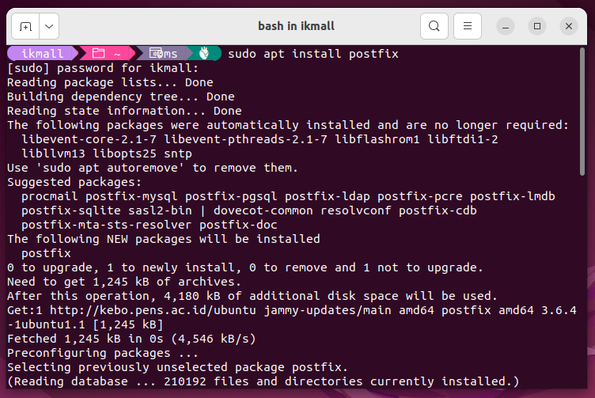
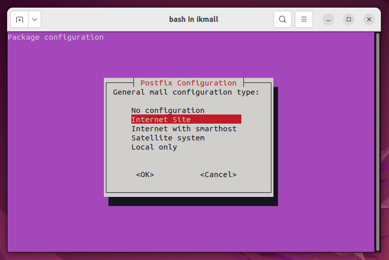
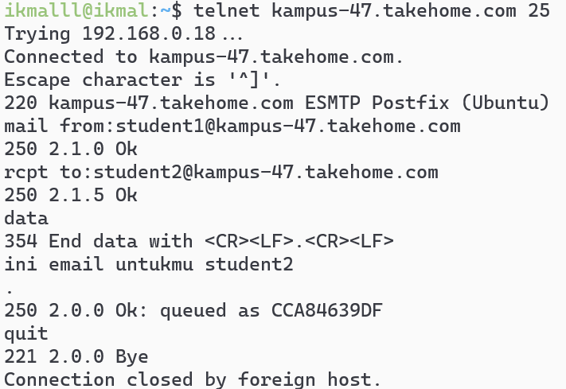
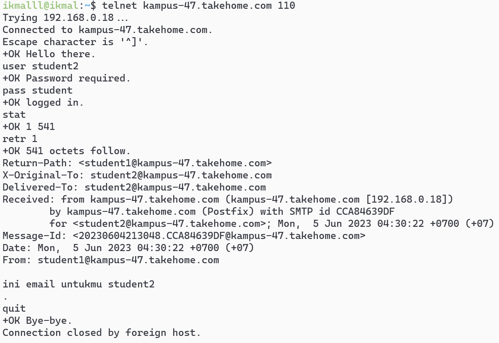

# Laporan Minggu 16


## Mail Server

## Kelompok 5
1. Emha Aji Putra Zaman (3121600042)
2. Marits Ikmal Yasin (3121600047)
3. Rizka Dwi Fajriyah (3121600050)

#
1. Install Postfix dengan perintah :
   ```
   sudo apt install postfix courier-imap courier-pop
   ```
   Gambar : <br>
   
2. Klik internet Site
   Gambar : <br>
   
   <br>
   Selanjutnya klik OK
3. Klik OK terus, dan pilih yes untuk create directories
4. Buat direktori Maildir :
   ```
   sudo maildirmake /etc/skel/Maildir
   ```
   > Mengapa membuat **Maildir** nya di **/etc/skel** Karena nanti jika kita melakukan penambahan user baru, maka semua file/folder didalam **/etc/skel** akan ikut dicopy kan, jadi kita tidak perlu repot-repot untuk membuat Maildir secara manual jika kita melakukan penambahan user.
5. Perintah berikut digunakan untuk menambahkan direktori **Maildir** pada user yang sedang kita pakai saat ini
   ```
   maildirmake $HOME/Maildir
   ```
6. Konfigurasi postfix pada file main.cf :
   ```
   sudo nano /etc/postfix/main.cf
   ```
   Pada `mydestination` tambahkan mx domain kalian. Pada `mynetworks` kalian bisa tambahkan blok network tertentu atau semuanya dengan wilcard all network `0.0.0.0/0`. Dan pada akhir line tambahkan `home_mailbox = Maildir/`. Di sini saya menggunakan nama kampus-47.takehome.com
7. Reload service postfix
   ```
   sudo systemctl reload postfix
   ```
8. Pengujian dengan membuat user student1 dan student2 dengan perintah:
   ```
   sudo adduser student1
   sudo adduser student2
   ```
9.  Pastikan anda sudah menginstall telnet dengan perintah:
    ```
    sudo apt install telnetd -y
    ```
10. Untuk melihat status telnet dengan perintah :
      ```
      sudo systemctl status inetd
      ```
11. Karena SMTP running pada port `25` maka kita dapat menggunakan telnet atau nc untuk melakukan pengiriman pesan. Pada contoh berikut user `student1` akan melakukan pengiriman pesan pada `student2`
   Gambar : <br>
   
12. Untuk melakukan pembacaan email kita akan menggunakan protokol pop3 yang running pada port `110`
    Gambar : <br>
   

Sampai di sini kita berhasil melakukan instalasi dan konfigurasi mail server menggunakan postfix dan courier
   
   

