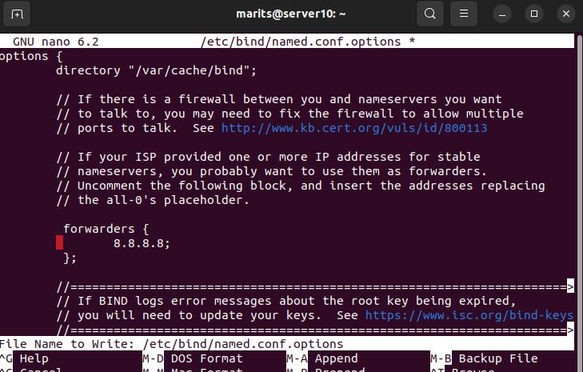
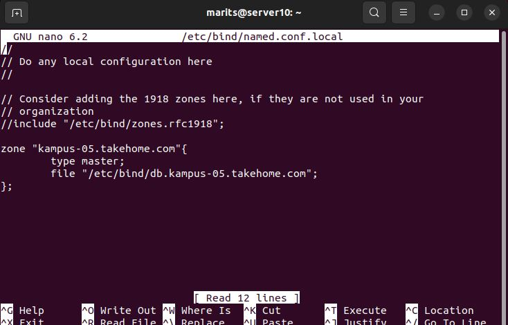
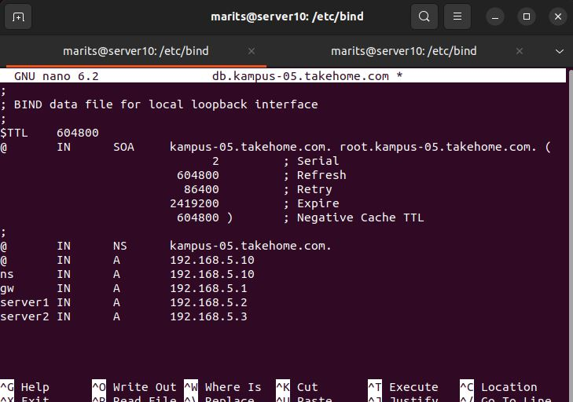
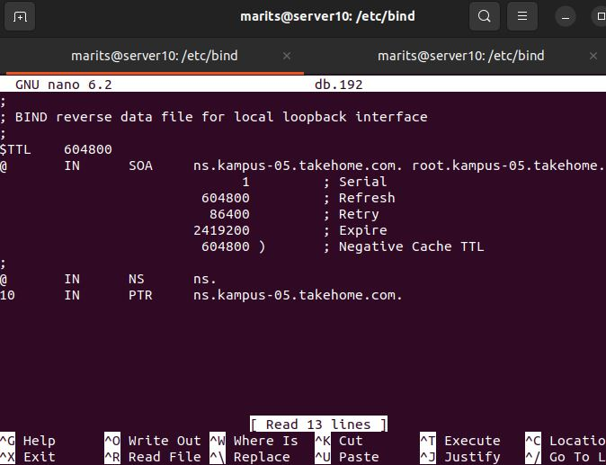
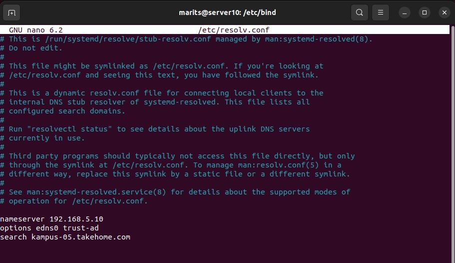
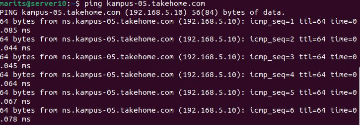
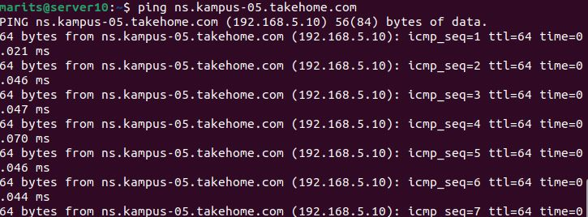

# Laporan Minggu 6


## Domain Name Service (DNS)

## Kelompok 5
1. Emha Aji Putra Zaman (3121600042)
2. Marits Ikmal Yasin (3121600047)
3. Rizka Dwi Fajriyah (3121600050)

## Pengertian Domain Name Service (DNS)
Domain Name Service (DNS) adalah layanan Internet yang memetakan alamat IP dan nama domain yang memenuhi syarat (FQDN) satu sama lain. Dengan cara ini, DNS mengurangi kebutuhan untuk mengingat alamat IP. Komputer yang menjalankan DNS disebut name servers. Ubuntu dilengkapi dengan BIND (Berkley Internet Naming Daemon), program yang paling umum digunakan untuk mengelola name servers di Linux.

## Tata cara untuk membuat DNS
1. Install Bind9 dan dns util pada terminal
   ```
   sudo apt install bind9
   ```
   ```
   sudo apt install dnsutils
   ```
2. Edit file pada direktori `/etc/bind/named.conf.options` dengan perintah :
   ```
   sudo nano /etc/bind/named.conf.options 
   ```
   Gambar : <br>
   
3. Restart kembali service bind 9 
   ```
   sudo systemctl restart bind9.service
   ```
4. Tambahkan zona dns ke bind9 dan ubah bind9 menjadi server primer dengan perintah :
   ```
   sudo nano /etc/bind/named.conf.local
   ```
   Gambar : <br>
   
5. Membuat zona file baru dengan melakukan copy file yang sudah ada dengan perintah :
   ```
   sudo cp /etc/bind/db.local /etc/bind/db.kampus-05.takehome.com
   ```
6. Editlah file yang sudah diduplikat tadi dengan perintah :
   ```
   sudo nano /etc/bind/db.kampus-05.takehome.com
   ```
   Gambar : <br>
   
7. Restart kembali bind9 dengan perintah :
   ```
   sudo systemctl restart bind9.service
   ```
8. Reverse Zone file digunakan untuk mengubah domain menjadi alamat ip. Hal ini perlu ditambahkan guna DNS mengubah alamat IP menjadi nama. Untuk melakukannya dengan perintah :
   ```
   sudo nano /etc/bind/named.conf.local
   ```
9. Pada file tersebut tambahkan syntak berikut ini :
    ```
    zone ''5.168.192.in-addr.arpa"{
      type master;
      file"/etc/bind/db.192";
    }
    ```
10. Buatlah file /etc/bind/db.192 dengan perintah :
    ```
    sudo cp /etc/bind/db.127 /etc/bind/db.192
    ```
11. Edit file db.192 dengan perintah :
    ```
    sudo nano /etc/bind/db.192
    ```
    Gambar : <br>
    
12. Restart kembali bind9 dengan perintah :
      ```
      sudo systemctl restart bind9.service
      ```
13. Edit file `/etc/resolv.conf` dengan perintah :
      ```
      sudo nano /etc/resolv.conf
      ```
      Gambar : <br>
      
15. Testing
    - ping terhadap `kampus-05.takehome.com` <br>
      Gambar : <br>
      
    - ping terhadap sub domain `ns.kampus-05.takehome.com` <br>
      Gambar : <br>
       
    